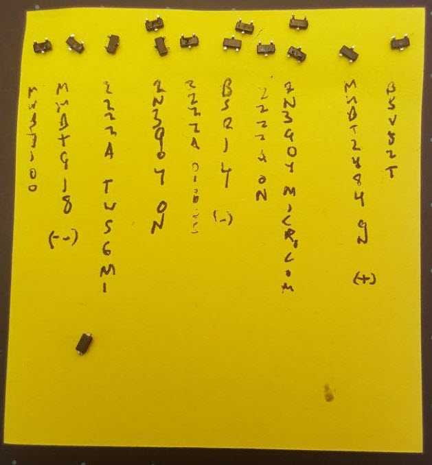
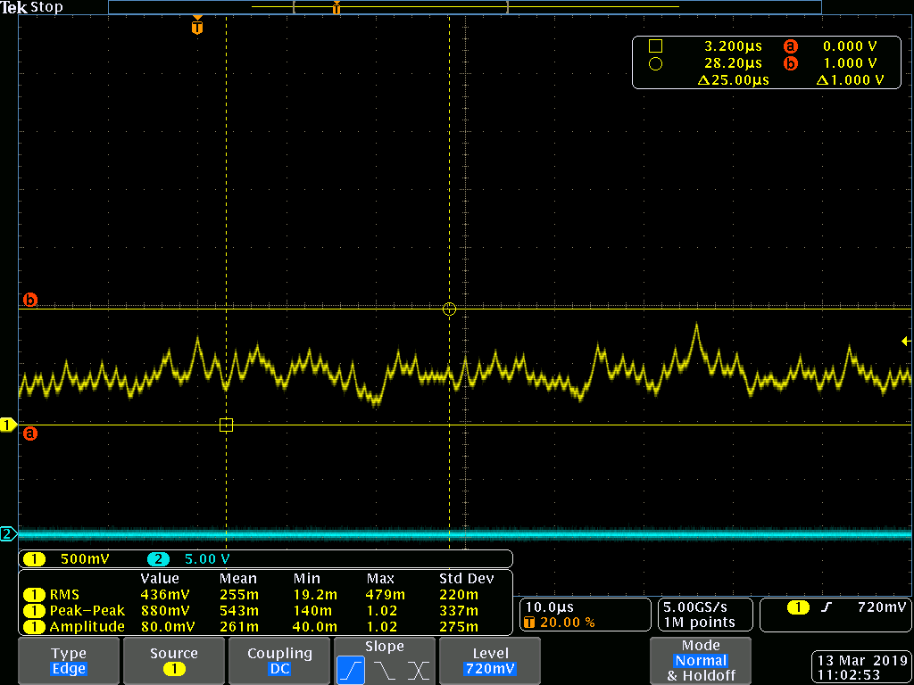
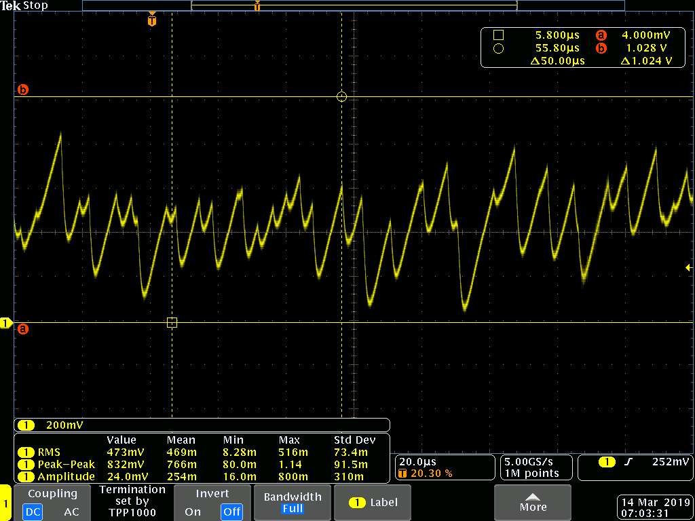

# Avalanche Noise Source Design

# Motivation

A high quality noise source is necessary for any good crytpographic
enclave. In fact, multiple high quality noise sources are preferable,
if the budget allows.

On-die RNGs such as ring-oscillator based RNGs leverage the
metastability of sampling circuits to translate timing jitter into a
random stream of bits. These are area and power efficient but are also
tricky to verify. They are particularly vulnerable to [subtle mask-editing
attacks](https://sharps.org/wp-content/uploads/BECKER-CHES.pdf).

In addition to an on-die RNG, betrusted's entropy pool in reinforced
by an externally testable noise source. Avalanche noise sources fit
the bill, as they can delivery reasonably high quality entropy and
verification can be done using a low-end "economy" oscilloscope. 

The challenges of avalanche noise sources include the need for high
(10-30V) voltages (and correspondingly high power consumption), and
there the amount of noise generated depends on subtleties such as the
engineering of the PN junction and the ambient temperature. Here we
discuss the design and implementation of an avalanche noise source
suitable for integration into a low-power, small-footprint mobile
device.

# Avalanche Breakdown Theory

Readers who just want to skip to the design can safely jump over this
section. However, few discussions of avalanche noise sources address
the theory of the noise source, which is important to understand when
trying to rationalize power and component selection. If you plan to
adjust or tweak the design, it's recommended you at least skim this
section.

Avalanche breakdown is essentially a miniature particle accelerator, where electrons that enter a PN junction's depletion region (through mechanisms that include thermal noise) are accelerated across an electrical field, to the point where new electron-hole pairs are generated when these high-energy electrons collide with atoms in the depletion region, creating an amplification cascade with low reproduceability.

An approximate analogy is an inflatable pool filled with water. The height of the pool is the potential barrier of the reverse-biased PN junction. A hose feeding water into the pool represents a constant current of electrons. The volume of the pool can be thought of as the depletion capacitance, that is, the capacitor created by the region of the junction that is void of carriers due to natural drift and diffusion effects. As water trickles into the pool, the water level rises and eventually forms a meniscus. Random disturbances, such as ripples on the surface due to wind, eventually cause the meniscus to crest over the edge of the pool. The water flowing over the edge pushes down on the inflatable pool's side, causing more water to flow, until the level has reduced to a point where the inflatable pool's side can snap back into its original shape, thus restarting the cycle of filling, cresting, and breakdown. The unpredictability of when and where the breakdown might happen, and how much water flows out during the event, is analogous to the entropy generated by the avalanche effect in a PN junction.

The electrical characteristic of avalanche noise biased by a constant current source is a “sawtooth” waveform: a linear ramp up in voltage as the capacitance of the depletion region charges to the point where the electric field becomes large enough to initiate the cascade, and then a sharp drop off in voltage as the cascade rapidly discharges the junction capacitance. The cascade then abruptly halts once the field is no longer strong enough to sustain the cascade effect, leading to a subsequent cycle of charging and breakdown.

Avalanche diodes are high voltage devices because of the physics
behind them. The breakdown voltage of the junction is controlled by
the doping levels of the P and N regions:

Vbr = (Ecr^2 * Esi / 2q) * ((Na + Nd) / Na * Nd)

* Ecr is the critical value of the electrical field, a physical constant that ranges from 210^5 V/cm to 810^5 V/cm depending on the doping
* Esi is the dielectric constant of silicon
* q is the elementary charge of an electron
* Na is the doping concentration of the P region
* Nd is the doping concentration of the N region

Vbr increases as the temperature increases: as temperature goes up, so
does lattice vibrations. Electrons are thus more likely to be
scattered before they can be accelerated to a sufficient momentum to
initiate the avalanche cascade. Thus a given junction engineered for
a fixed Vbr exhibits decreased noise at higher temperatures. When confirming
the performance of an avalanche noise source, it's therefore important
to confirm its performance at the highest expected operating temperatures.

In order to engineer a low voltage breakdown, the doping Na and Nd
must be so high that the depletion region shrinks to a distance on the
order of 10nm, such that quantum tunneling becomes the dominant
effect. Quantum tunneling is synonymous with the "zener" effect, and
is a different physical process which generates less noise. Thus for
reverse-breakdown junctions that operate below 4.5-6.5V, the process
is predominantly a zener effect and not as suitable for noise
generation. This explains why avalanche noise generators must operate
at higher voltages.

Note that Vbr decreases as temperature increases for the zener effect,
opposite the avalanche effect. Thus "zener diodes" sold for the
purpose of voltage regulation are actually engineered to use a
combination of quantum zener plus avalanche effects, as they have
opposite temperature coefficients and can lead to a more
temperature-stable voltage reference.

They hybrid engineering of the zener diodes has lead to some confusion
when selecting suitable parts as an avalanche noise source. However,
zener diodes above 7V or so start to rely more and more on avalanche
breakdown, so one may more accurately call a high voltage zener diode
an avalanche breakdown diode. 

Note that avalanche diodes to be used as voltage references are
engineered to be less suitable as a noise source. Obviously, if the
goal of the Vbr is as a voltage reference, reduced noise is highly
desired. Generally, noise can be reduced by operating the diode at a
higher current: more carriers means more opportunities to initiate the
avalanche cascade. However, simply cranking up the current would also
waste power. Thus avalanche diodes engineered as a voltage reference
are designed so that the junctions are "leaky" compared to a typical
rectifier application -- perhaps through a very large area junction,
with trace amounts of minority carrier dopants added to seed reverse
leakage. Increasing low-level reverse-bias leakage reduces avalanche
noise at lower current levels, because the tiny leakage helps "seed"
the avalanche effect more consistency.

Thus when evaluating devices, the following are positively correlated
with increased noise generation:

* Higher breakdown voltage
* Lower leakage current in reverse bias

A variety of inexpensive zener regulators as well as ESD protection
diodes meet this criteria. ESD protection diodes in particular care
little about how much avalanche noise is generated, and may prioritize
lower leakage in reverse bias instead. 

### NPN transitor junctions

A discussion of B-E junctions of NPN transistors as an avalanche
noise source is warranted due to its popularity in inexpensive
noise sources. B-E junctions are engineered with very heavy doping on
the E side, and light doping on the B side. This causes a very narrow
depletion region on the emitter, and a large depletion region on the B
side. In this case Vbr is dominated by Na, e.g.:

Vbr ~ 1/Na

The heavier the emitter doping, the lower the Vbr. And emitters on NPN
transistor are heavily doped, so Vbr tends to be in a the range of
5-12V. The low breakdown voltage and wide availability of NPN
transistors thus makes the device appealing.

Unfortunately, the threshold between zener breakdown and avalanche
isn't a clear line; in fact, NPN transistors with breakdowns
approaching the 5V range exhibit behavior closer to zener breakdown
(quantum tunneling) and are thus less suitable as a noise source.

Furthermore, because NPN transitors are not well-characterized for
their reverse B-E breakdown, the quality of the noise generated can
vary widely between manufacturers and models. The Internet also
contains anecdotes that over time the B-E junction "wears out" over
a period months and the quality of noise degrades, but there is no
discussion of mechanism or backup with measurements. 

# Circuit Design

Thus, the desired properties for the mobile-friendly avalanche noise
circuit are:

* Constant current source, adjustable to uA-range
* High voltage compliance on the constant current source (to 30V+)
* Post-noise source amplification/signal conditioning
* Small footprint (<1 cm^2)
* Low active power (< 5mW)
* Standby mode

Fortunately, most of these requirements are met by a class of regulators
meant for controlling LCD blacklights and/or white LEDs. Photonic flux
of an LED is proportional to current (not voltage) and thus for consistent
light output across a wide range of devices LED regulators are almost
always constant current sources. The desire to stack multiple LEDs on
top of each other means almost all of these devices have very high
voltage compliance as well.

The [TPS61158](http://www.ti.com/product/TPS61158) is identified as
one of many suitable devices, this one chosen because it has a voltage
cap at 30V, and features reasonable standby power and quiescent
current draw. There may be others with even better characteristics,
but the search stopped with this part because it met the desired
properties of the circuit.

The final configuration simply replaces the LED string with a PN
junction in reverse bias, along with a resistor stacked above the PN
junction to provide some voltage compliance for the noise to generate.
The voltage compliance is pure resistive power loss, so we target
around a 1-2V compliance voltage, as the anticipated noise voltage is
around 500mVp-p.

The main risk point of the circuit is operation at extremely low
currents; the circuit is normally specified to provide 20mA of
current, and we are operating it around a few uA.  The low current
operation may lead to instability in the regulator control loop and
cause problems with circuit startup, so this needs to be characterized
carefully.

The cathode of the noise generator is AC-coupled to a resistive
divider that centers the noise within the sweet spot of an amplifier
that provides a 6:1 gain on the generated noise. More important than
the voltage gain is the impedance matching to the sampling circuit.
The noise generator runs at a very low current, and thus is incapable
of driving any significant load. Thus even if the amplitude of the
noise source was sufficient for direct sampling or use, a signal
conditioning buffer of some sort would still be necessary to provide
sufficient drive current for the ultimate circuit load. The target
sampling circuit in this case is a 1MSPS 12-bit ADC with a 0-1V input
range.

# Circuit Characterization

Several devices were evaluated for their noise performance
using the circuit as designed: 

|Part number	|Mfg	        |Vbr   |noise mVpp |Type |
|---------------|---------------|------|-----------|-----|
|MMBT2222A-7-F	|Diodes Inc	|7.52  |69.6	   |NPN  |
|MMBT3904LT1G	|On semi	|7.8   |80.4	   |NPN  |
|MMBT2484	|On semi	|10.65 |571	   |NPN  |
|BSV52LT1G	|On semi	|7.39  |74.5	   |NPN  |
|MMBT100	|On semi	|8.43  |157	   |NPN  |
|MMBT2222A	|On semi	|8.69  |107	   |NPN  |
|MMBT3904-TP	|Microcom	|8.66  |115	   |NPN  |
|MMSZ15T1G	|On semi	|15.34 |379	   |zener|
|DDZ9V1C-7	|Diodes Inc	|9.31  |89	   |zener|
|MMSZ525BT1G	|On semi	|24.3  |951	   |zener|

Vbr is the measured breakdown voltage at a 3.16uA bias
current and roughly 3V of compliance provided by the
ballast resistor above the diode.

Note that the measurement limit for noise is around 70mVp-p, so some
NPN transistors were possibly generating little to no noise.  In
general, it was observed that devices with higher breakdown voltages
would generate more noise.

We settled on a 15V zener diode (MMSZ15T1G) as the initial device for
noise generation. This device is squarely in the middle of the range
of the TPS61158 regulator, is comfortably above the zener threshold,
yet not excessively high (as a higher voltage would lead to higher
power dissipation), and is guaranteed by the manufacturer to breakdown
at a certain voltage. Although more noise was witnessed on a 24V
breakdown device, operation near the cutoff threshold of the TPS61158
made the circuit unreliable under some startup conditions. Any lack in
amplitude could be restored anyways by the follow-up signal
conditioning circuitry.

Above is the initial noise trace as measured by the circuit. One
key observation is that the maximum frequency of the noise is quite
high (>> 1MHz), which leads to some bandwidth degradation as it
feeds into the low-power op amp (GBW of 1.4 MHz).

The bandwidth of noise, and to a lesser extent the amplitude, can
be tuned by placing a small capacitor in parallel with the avalanche
junction. In this case, the MMSZ15T1G has about a 110pF or so depletion
capacitance, so the parallel tuning capacitor should be sized around one
order of magnitude larger. Basically what the parallel capacitor does
is bleed away some of the current feeding into the junction, causing
it to build up a field more slowly and thus reducing the bandwidth.

With a 1500pF capacitor placed in parallel with the noise source,
we observe the following optimized noise trace, measured after
the signal conditioning amplifier.

The noise in this case has a bandwidth that is suitable for sampling
by the 1MSPS ADC, and the amplitude is close to 0-1V.

The optimized circuit has the following characteristics:

* 0.526mA @ 3.3V active current draw
* 0.0124mA @ 3.3V standby current draw (mostly LDO leakage, not shown in circuit)
* successfully boots at 2.8V and 4.4V
* generates noise at 0C and 80C. At 0C the noise is about 50% larger in amplitude, at 80C it's about 50% smaller in amplitude.

Notes: 
* The voltage on the regulation capacitor has a
non-trivial amount of ripple. This probably applies a signature on the
noise generated.
* The TPS61158 draws about 1uA through the feedback
pin, which means of the target 4.2uA bias current, 1 uA is shunted into
the feedback pin (resulting in 3.2uA going into the diode).

# Next Iteration

The overall footprint is around 1 cm^2, and can be optimized further
by going to a smaller inductor. The inductor initially chosen for the
test circuit is greatly oversized for the application (just in case
higher current were needed for testing). A much smaller inductor,
perhaps an 0603 or 0805 part, could be used thus reducing the
footprint even further. For example, a TDK MLZ1608M220WT000 is in an
0603 package and saturates at 55mA. This should be sufficient given
the operating current of 3uA, although there is some question about
the inductor's performance during power-on.

A smaller footprint for the noise generating diode could be used as well.
The initial layout used a SOT-23 footprint to accommodate a wide variety of
devices but the final circuit could use a SOD-523. The following devices
are candidates to be tested:

* BZT585B15T, BZT585B18T - zener diode, intended for voltage reference purposes
* PESD12VS1UB, PESD15VS1UB - TVS diode, intended for circuit protection

